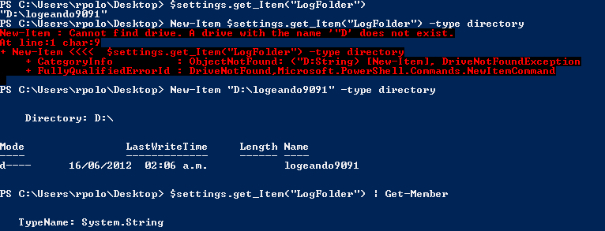
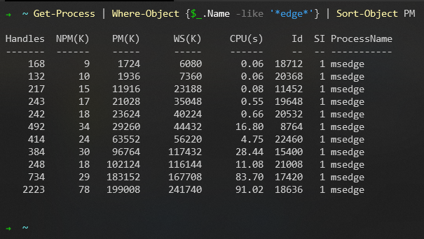
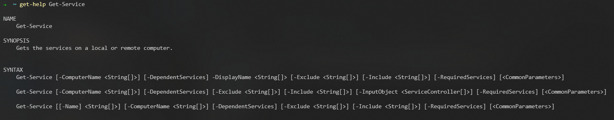
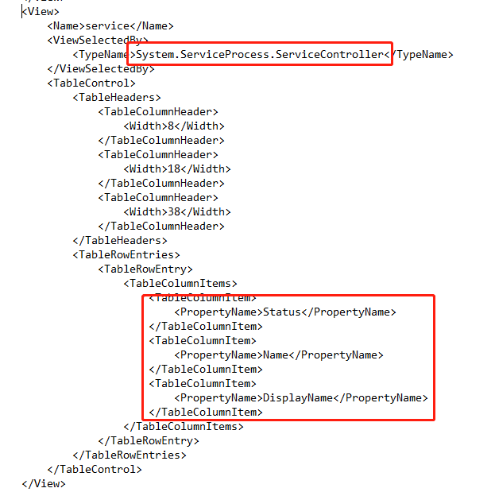
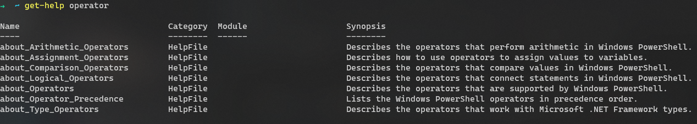

# 成为 PowerShell 大师

## 1 前言
对于从 `*nix` 过来的小伙伴，对于 `bash` 操作肯定不陌生，比如 awk, sed 和 grep 等命令用的飞起。来到 Windows 平台，cmd.exe 简直难用到爆炸，那么为什么不尝试使用 PowerShell 这个工具呢？

本教程将涉及以下几个方面：

1. PowerShell 的配置和安装
2. PowerSehll 使用说明
3. PowerShell 基本语法
4. PowerShell 的最佳实践

### 1.1 简介

首先什么是 PowerShell 呢？它是一套自动化任务和配置管理框架，主要由命令行和脚本语言构成。原先它是 Windows 的一部分，在 2016 年的时候微软将它[开源](https://github.com/PowerShell/PowerShell)并且跨平台，原先的 PowerShell 是基于 .Net Framework 现在基于 .Net Core, 所以跨平台的版本也叫做 PowerShell Core。

PowerShell 可以执行下面四种命令：
1. Cmdlet: 也就是常见的 `动词-名词` 组成的命令，比如 Get-Process, Remove-Item 等等。
2. PowerShell 脚本：以 ps1 后缀名的文件，通常是一系列命令组成的文件。
3. PowerShell 函数：在上下文中定义的函数，可以通过 PowerShell 调用。
4. 单独的可执行程序：对于可执行的程序，直接启动。

在技术论坛上，关于 PowerShell 和 Bash 的比较层出不穷，这里不去争论两者的优劣，每个工具都有自己的擅长和不足，正如 [Anders Hejlsberg](https://en.wikipedia.org/wiki/Anders_Hejlsberg) 说过:
> If you show me a perfect language, I can prove that nobody use it. 

我个人的观点是，如果是一些简单的任务，bash 是更加得心应手，因为这个符合 *inx 的设计哲学：Less is more。但是如果涉及到复杂而又繁琐的任务，PowerShell 更加得心应手一点，能够将控制项目的规模。 

### 1.2 安装

如果你是 Window 用户，那么系统中已经自带了 PowerShell, 只需要在开始搜索框内输入 PowerShell，点击即可启动 PowerShell；当然你也可以在 Windows 应用商城或者 [Github](https://github.com/microsoft/terminal) 购买或者下载 Terminal 软件，这是更加现代化的终端。对于 Linux/MacOS 用户，可以 [Github Powershell](https://github.com/PowerShell/PowerShell) 页面下载对应的版本。

当然可以查阅官方文档：
- [Windows 安装](https://docs.microsoft.com/en-us/powershell/scripting/install/installing-powershell-core-on-windows?view=powershell-7)
- [Linux 安装](https://docs.microsoft.com/en-us/powershell/scripting/install/installing-powershell-core-on-linux?view=powershell-7)
- [MacOS 安装](https://docs.microsoft.com/en-us/powershell/scripting/install/installing-powershell-core-on-macos?view=powershell-7)

在安装完毕，打开 PowerShell 交互界面，输入 `$PSVersionTable` 

```
PS C:\Program Files\PowerShell\7> $PSVersionTable

Name                           Value
----                           -----
PSVersion                      7.0.0
PSEdition                      Core
GitCommitId                    7.0.0
OS                             Microsoft Windows 10.0.18363
Platform                       Win32NT
PSCompatibleVersions           {1.0, 2.0, 3.0, 4.0…}
PSRemotingProtocolVersion      2.3
SerializationVersion           1.1.0.1
WSManStackVersion              3.0
```

从输出内容可以知道，当前的使用的 PowerShell Core 7.0 版本，而且运行在 Windows 平台上。

大部分人吐槽 Powershell 的界面特别丑，因为它的默认是这样的：



这也难怪 Steve Jobs 曾经说过，Microsoft 最大的问题是没有品味；但是毛主席也教导我们：自己动手，丰衣足食。*nix 下 bash 好看是因为大量的第三方主题配置，所以我们现在为 PowerShell 修改它的默认配置。

//todo

最后 PowerShell 页面样式是这样的


### 1.3 热身

#### 1.3.0 Get-Command


#### 1.3.1 Get-Help 

在 Bash 中有一个很棒的 man 命令，它可以查询任意命令的详细文档。在 PowerShell 使用 Get-Help 命令也可以达到同样的效果，比如说：

```ps
➜  ~ Get-Help Get-ChildItem

NAME
    Get-ChildItem

SYNOPSIS
    Gets the files and folders in a file system drive.


SYNTAX
    Get-ChildItem [[-Filter] <String>] [-Attributes {ReadOnly | Hidden | System | Directory | Archive | Device | Normal | Temporary | SparseFile | ReparsePoint | Compressed | Offline | NotContentIndexed | Encrypted | IntegrityStream |
    NoScrubData}] [-Depth <UInt32>] [-Directory] [-Exclude <String[]>] [-File] [-Force] [-Hidden] [-Include <String[]>] -LiteralPath <String[]> [-Name] [-ReadOnly] [-Recurse] [-System] [-UseTransaction] [<CommonParameters>]

    Get-ChildItem [[-Path] <String[]>] [[-Filter] <String>] [-Attributes {ReadOnly | Hidden | System | Directory | Archive | Device | Normal | Temporary | SparseFile | ReparsePoint | Compressed | Offline | NotContentIndexed |
    Encrypted | IntegrityStream | NoScrubData}] [-Depth <UInt32>] [-Directory] [-Exclude <String[]>] [-File] [-Force] [-Hidden] [-Include <String[]>] [-Name] [-ReadOnly] [-Recurse] [-System] [-UseTransaction] [<CommonParameters>]

    Get-ChildItem [-Attributes <FileAttributes]>] [-Directory] [-File] [-Force] [-Hidden] [-ReadOnly] [-System] [-UseTransaction] [<CommonParameters>]


DESCRIPTION
    The Get-ChildItem cmdlet gets the items in one or more specified locations. If the item is a container, it gets the items inside the container, known as child items. You can use the Recurse parameter to get items in all child
    containers.

    A location can be a file system location, such as a directory, or a location exposed by a different Windows PowerShell provider, such as a registry hive or a certificate store.
    In a file system drive, the Get-ChildItem cmdlet gets the directories, subdirectories, and files. In a file system directory, it gets subdirectories and files.

    By default, Get-ChildItem gets non-hidden items, but you can use the Directory, File, Hidden, ReadOnly, and System parameters to get only items with these attributes. To create a complex attribute search, use the Attributes
    parameter. If you use these parameters, Get-ChildItem gets only the items that meet all search conditions, as though the parameters were connected by an AND operator.

    Note: This custom cmdlet help file explains how the Get-ChildItem cmdlet works in a file system drive. For information about the Get-ChildItem cmdlet in all drives, type "Get-Help Get-ChildItem -Path $null" or see Get-ChildItem at
    http://go.microsoft.com/fwlink/?LinkID=113308.


RELATED LINKS
    Online version: http://technet.microsoft.com/library/hh847897(v=wps.630).aspx
    Get-ChildItem (generic); http://go.microsoft.com/fwlink/?LinkID=113308
    FileSystem Provider
    Clear-Content
    Get-Content
    Get-ChildItem
    Get-Content
    Get-Item
    Remove-Item
    Set-Content
    Test-Path

REMARKS
    To see the examples, type: "get-help Get-ChildItem -examples".
    For more information, type: "get-help Get-ChildItem -detailed".
    For technical information, type: "get-help Get-ChildItem -full".
    For online help, type: "get-help Get-ChildItem -online"
```

如果你的 `Get-Help` 没有输出相应的内容，使用 `Update-Help` 命令更新一下。当然也可以在每个命令最后添加 `-?` 就可以打开相应的帮助文档。

每个命令的帮助文档看上去密密麻麻，让人劝退的感觉，下面以 `Get-Service` 的帮助文档解释做进一步解释。 


可以知道 Get-Service 主要有三种使用方式，每一种方式的参数叫做 `ParameterSet`，不同参数用不同的方式形式修饰，主要有下面几种: 

|     形式     	|            含义             |
|:------------	|:-------------------------- |
| [[-Param] T] 	| 可选参数，参数名可以省略      |
| [-Param T]   	| 可选参数，参数名不可以省略 	|
| -Param T     	| 必选参数                   	|
| [-Param]     	| 开关参数                   	|


#### 1.3.4 Ge-Member

既然我们已经知道在 Powershell 中传递的是 Object，我们都知道谈到对象就需要涉及到 `property` 和 `class` 等等，那么如何该如何知道在 PowerShell 中了解到这些信息呢？答案就是调用 `Get-Member` 方法，举例来讲

```ps
Get-Service | Get-Memeber


   TypeName: System.ServiceProcess.ServiceController

Name                      MemberType    Definition
----                      ----------    ----------
Name                      AliasProperty Name = ServiceName
RequiredServices          AliasProperty RequiredServices = ServicesDependedOn
Disposed                  Event         System.EventHandler Disposed(System.Object, System.EventArgs)
Close                     Method        void Close()
Continue                  Method        void Continue()
CreateObjRef              Method        System.Runtime.Remoting.ObjRef CreateObjRef(type requestedType)
Dispose                   Method        void Dispose(), void IDisposable.Dispose()
Equals                    Method        bool Equals(System.Object obj)
ExecuteCommand            Method        void ExecuteCommand(int command)
GetHashCode               Method        int GetHashCode()
GetLifetimeService        Method        System.Object GetLifetimeService()
GetType                   Method        type GetType()
InitializeLifetimeService Method        System.Object InitializeLifetimeService()
Pause                     Method        void Pause()
Refresh                   Method        void Refresh()
Start                     Method        void Start(), void Start(string[] args)
Stop                      Method        void Stop()
WaitForStatus             Method        void WaitForStatus(System.ServiceProcess.ServiceControllerStatus desiredStatus), void WaitForStatus(Syst... 
CanPauseAndContinue       Property      bool CanPauseAndContinue {get;}
CanShutdown               Property      bool CanShutdown {get;}
CanStop                   Property      bool CanStop {get;}
Container                 Property      System.ComponentModel.IContainer Container {get;}
DependentServices         Property      System.ServiceProcess.ServiceController[] DependentServices {get;}
DisplayName               Property      string DisplayName {get;set;}
MachineName               Property      string MachineName {get;set;}
ServiceHandle             Property      System.Runtime.InteropServices.SafeHandle ServiceHandle {get;}
ServiceName               Property      string ServiceName {get;set;}
ServicesDependedOn        Property      System.ServiceProcess.ServiceController[] ServicesDependedOn {get;}
ServiceType               Property      System.ServiceProcess.ServiceType ServiceType {get;}
Site                      Property      System.ComponentModel.ISite Site {get;set;}
StartType                 Property      System.ServiceProcess.ServiceStartMode StartType {get;}
Status                    Property      System.ServiceProcess.ServiceControllerStatus Status {get;}
ToString                  ScriptMethod  System.Object ToString();
```
`Get-Member` 方法会对于通过 `pipeline` 输入的每个类型进行展示，对于 `Get-Sevice` 所有输出都是 `ystem.ServiceProcess.ServiceController` 类型，下面展示了所有的这个对象包含的 `Method` 和 `Property`，除此之外还有 `AliasProperty`，它是 PowerShell 为输出结果添加的。既然 `ServiceController` 类型包含很多属性，但是为什么只有三个属性展示呢？它是由 `$PSHome\DotNetType.format.ps1xml` 格式化文件控制各个类型的输出



从中我们可以知道 `ServieController` 对象只输出 `Status`, `Name` 和 `DispalyName` 三个属性。


#### 1.3.2 PowerShell Gallery

正如 NuGet 包一样，PowerShell 也也有一个包仓库: [Powershell Gallery](https://www.powershellgallery.com/)，比如说安装 `PSSoftware` 这个模块

```ps
Install-Module -Name PSSoftware
```

通常这个命令是需要管理员权限执行，在安装完毕后，就可以使用 `PSSoftware` 包提供的[命令](https://github.com/adbertram/PSSoftware)。可以通过下面的命令查看这个模块下所有 PowerShell 命令。

```ps
Get-Command -Module PSSofteware
```

它会显示出这个模块下全部可以用的命令。


#### 1.3.3 IDE

所谓是工欲善其事，必先利其器。虽说脚本语言胜在灵活多变，我们也知道 PowerShell 对于大型工程而言是具有优势的，好的 IDE 也有助于写出健壮的代码。

- Wihdows PowerShell ISE. 这是 Windows 平台自带的一个 IDE
- Visual Studio Code. 这是一个跨平台的代码编辑器，安装相关的插件可以搭建 PowerShell 开发环境
- Jupyter Notebook. 如果你是 Python 的开发这，对这个开发工具肯定是非常熟悉，现在它也有了 PowerShell 的 [kernel](https://devblogs.microsoft.com/powershell/public-preview-of-powershell-support-in-jupyter-notebooks/)。

#### 1.3.4 Alias

通常来讲 PowerShell 的命令比较长（主要是为了方便记忆和理解），虽然自动补全可以帮助我们减少一些工作量，但是我们还是想要用更少的键盘敲击来完成命令，所以提供了 PowerShell 别名的方式。

```ps
Get-Alias
```

可以列出全部可用的 alias，也可以查看某个具体的 alias，比如说 

```ps
-> Get-Alias -Definition Get-ChildItem

CommandType     Name                                               Version    Source
-----------     ----                                               -------    ------
Alias           dir -> Get-ChildItem
Alias           gci -> Get-ChildItem
Alias           ls -> Get-ChildItem
```
`dir`, `gci` 和 `ls` 都是 Get-ChildItem 的别名，其中 `dir` 是 DOS 继承过来，`gci` 是命令首字母缩写而 `ls` 则是 *nix 系统下的命令。

而 `New-Alias` 可以自己创建相关的别名，比如 `New-Alias -Name "ll" -Value Get-ChildItem` 表示为 Get-ChildItem 创建了 `ll` 的别名。

## 2 语法

### 2.1 类型

我们都知道，脚本语言一般是动态语言，也就是说在运行的过程中也能修改变量的类型，所以 PowerShell 也是动态语言的一种。但是从某种意义上来讲，PowerShell 又是类型混合体，比如说你要从一个对象 `foo` 中获取属性 `Y`，它并不关心是 `foo` 是否属性对象 `X`，而是更关系 `foo` 是否有属性 `Y`。

PowerShell 有自己的成员（member)解析策略，分别为 
  
- Synthetic

PowerShell 提供了 `PSObject` 的封装器，用户可以创建一个实例，并且添加自己想要的属性。而且它只影响实例，而不影响 `PSOBject` 类型。

- Native
Native 就是指的是 PowerShell 对象指定的 .Net 的对象，同样要包含 `WMI` 和 `COM` 对象。

```ps
➜  ~ get-date | gm

   TypeName: System.DateTime

Name                 MemberType     Definition
----                 ----------     ----------
...
Subtract             Method         timespan Subtract(datetime value), datetime Subtract(timespan value)
ToBinary             Method         long ToBinary()
ToBoolean            Method         bool IConvertible.ToBoolean(System.IFormatProvider provider)
ToByte               Method         byte IConvertible.ToByte(System.IFormatProvider provider)
ToChar               Method         char IConvertible.ToChar(System.IFormatProvider provider)
ToType               Method         System.Object IConvertible.ToType(type conversionType, System.IFormatProvider provider)
ToUInt16             Method         uint16 IConvertible.ToUInt16(System.IFormatProvider provider)
ToUInt32             Method         uint32 IConvertible.ToUInt32(System.IFormatProvider provider)
ToUInt64             Method         uint64 IConvertible.ToUInt64(System.IFormatProvider provider)
ToUniversalTime      Method         datetime ToUniversalTime()
DisplayHint          NoteProperty   DisplayHintType DisplayHint=DateTime
Date                 Property       datetime Date {get;}
Day                  Property       int Day {get;}
DayOfWeek            Property       System.DayOfWeek DayOfWeek {get;}
Second               Property       int Second {get;}
Ticks                Property       long Ticks {get;}
TimeOfDay            Property       timespan TimeOfDay {get;}
Year                 Property       int Year {get;}
DateTime             ScriptProperty System.Object DateTime {get=if ((& { Set-StrictMode -Version 1; $this.DisplayHint }) -ieq  "Date")...
...
```

- Fallback
这是 PowerShell Runtime 为其添加的类型，并且用户不能修改。

#### 2.1.1 字面字符串
在 PowerShell 中有两种方式表示字面字符串，分别使用单引号和双引号表示。它们有一个显著的的区别是在双引号中可以做变量替换，或者 PowerShell 表达式计算，具体个例子

```ps
PS> $foo = "FOO"
PS> "This is a string in double quotes: $foo"
This is a string in double quotes: FOO

PS> 'This is a string in single quotes: $foo'
This is a string in single quotes
```
我们可以看到在双引号的字符串中，`$foo` 变量被正确的替换成了 `FOO`，如果不想在双引号中替换做变量替换怎么办呢？在变量前添加中间隔符号

```ps
PS> $foo = "BAR"
PS> "`$foo is $foo"
$foo is BAR
```
同样也可以在双引号字符串中做 PowerShell 相关的表达式计算。

```ps
PS> $date=Get-Date
PS> "Today is week of $($date.DayOfWeek)"
Today is week of Wednesday
```
这有点像 C# 中字符串内插格式化。还有一种字符串表示方法叫做 `here string`, 具体使用如下

```ps
PS> $a = @"
One is "1"
Two is "2"
Three is $(2+1)
The date is "$(Get-Date)"
"@
PS> $a
One is "1"
Two is "2"
Three is 3
The data is "Wednesday, May 20, 2020 8:50:37 PM"
```
用 `@"` 和 `"@` 包围的都是字符串的一部分，并且也能做相应的表达式计算，但是要注意 `@"` 之后的内容必须要空一行，而 `"@` 也必须要另起一行开始。

#### 2.1.2 数字和字面数值

对于字面数值，`PowerShell` 能自动帮你选择最合适的类型，对于整数类型，会选择 `int32` 类型，对于超出 `int32` 类型能表示的范围之外的整数，则选择 `int64` 类型；而对于小数，默认选择 `double` 类型，除非在数值前指定 `[float]`，则使用单精度表示，最后对于 `decimal` 类型，需要在后面添加 `d` 后缀表示。

除此之外，PowerShell 还支持 `KB`, `MB` 或者 `GB` 等等后缀，相当于表示 `1024`，`1024 * 1024` 和 `1024 * 1024 * 1024` 相应的数值。

#### 2.1.3 字典

字典是存储键值对的容器，它的表示构造方法非常简单
```ps
PS> $user = @{ FirstName = "John"; LastName = "Smith"; PhoneNumber = "555-1212"}
```

可以通过 `@{` 和  `}` 来创建一个字典，如果知道了键，有两种方式去访问其对应的值。
```ps
PS> $user.firstname
John
PS> $user["lastName"]
Smith
```
也可以通过键的数组访问多个值

```ps
PS> $user['firstName', 'lastname'];
John
Smith
```

有一点要注意的是，在 PowerShell 中，字典是一个标量，也就是说在 `foreach` 语句中迭代一个字典并不会和 C# 一样每次迭代一个 `Key-Value` 对，而是一个整体对象。那么该如何枚举字典中的对象呢？有两种方法：
1. 迭代字典的 `Keys` 和 `Values` 属性
2. 调用 `GetEnumerator()` 方法，迭代 `Key-Value` 对

还有，字典中的数据迭代是无序的，跟插入的顺序没有关系。所以如果想要有序的字典，请在字典申明之前添加 `[ordered]` 前缀。我们都知道在 C# 中字典是引用传递，在 PowerShell 中也是同样如此，如果两个变量表示同一个字段对象，那么它们的修改在另一个变量中也能看得到。如果想要避免引用传递带来的问题，请调用 `clone()` 的方法来赋值个另一个变量。

#### 2.1.4 数组
PowerShell 中没有一个关于数组的明确定义，接下来将使用一些例子来展示一下数组的表示和使用

```ps
PS> $a = 1, 2, 3
PS> $a.GetType().FullName
System.Object[]
PS> $a[0] = 3.1415
PS> $a[2] = 'Hi there'
PS> $a += 22, 33
PS> $a.Length
5
PS> $a[4]
33
PS> (, 1).Length
1
PS> @().Length
0
```

还要强调的一点是数组也是引用传递的，如果想要消除这种影响，请使用 `clone()` 方法。


### 2.2  操作符

运算是 PowerShell 的重要组成部分，也是我们编程的目的之一。使用 `Get-Help Operator` 命令可以显示所有的操作符运算



从种我们可以知道 PowerShell 支持多种运算操作，接下来我们就一一进行介绍。

#### 2.2.1 算术运算
主要包含了 `+`, `-`, `*`, `/` 和 `%` 五种算数运算。
对于加法运算，规则如下：

- 左边为数值，尝试将右边的操作数转换为数值，然后相加
- 左边为字符串，尝试将右边的操作数转换为字符串，然后字符串合并
- 左边为数组集合，如果右边是标量，将其添加到集合中
- 左边为数组集合，如果右边也是集合，将右边集合添加到左边，拼接起来

```ps
PS> 1 + '123'
1123
PS> "HelloWorld" + 1
HelloWorld1
PS> $a = 1, 2, 3
PS> $a + 4
1
2
3
4
PS> $b = "Hello", "World"
PS> $a + $b
1
2
3
4
Hello
World
```

对于乘法，只支持数组，字符串和数组三种类型，更具体地一点是右边地操作数只支持数值。

- 如果左边地操作符是字符串，那么相等于重复字符串若干次
- 如果左边的操作符是数组，那么相当于重复数组内容若干次

对于剩下的运算符，更多的是数学意义上的运算，要注意的一点是在 PowerShell 中，除法运算更多的是数学意义上的除法，也就是说并不会说出现类似 `C#` 语言中的 `5/4=1` 这种情况。

#### 2.2.2 赋值运算

赋值运算主要包含如下几种 `=`, `+=`, `-=`, `*=`, `/=` 和 `%=`，其作用和其他语言类似，所以不必过多解释。值得注意的是在 PowerShell 中可以多个赋值，就跟 Python 或者 Go 语言中一样，比如使用下面语句交换两个变量

```ps
PS> $a, $b = $b, $a
```

#### 2.2.3 比较操作

PowerShell 中包含了大量的比较操作，主要有 `eq`, `ne`, `gt`, `ge`, `lt` 和 `le` 几类和相应的大小写敏感（`c`）和大小写不敏感( `i` ) 三类组成，其中默认为大小写不敏感。

对于标量数据而言，它的比较就是字面上意思的比较，比如说：

```ps
PS> 123 -lt 123.4
True
PS> 'abc' -eq 'ABC'
True
PS> 'abc' -ceq 'ABC'
False
```

如果左边的操作数是数组，那么就判断数组中的元素匹配右边的元素

```ps
PS> 1, '2', 3, 2, '1' -eq '2'
2
2
PS> 1, '2', 3, 2, '1' -gt '2'
3
```

当然也可以使用 `-contains`, `-notcontains`, `-in` 和 `-nin` 等方式表达，返回 `True` 或者 `False`。

```ps
PS> 1, 2, 3 -contains 2
True
```

#### 2.2.4 模式匹配
这里涉及到更多的是文本相关的操作，主要有以下几类操作 `-like`, `-notlike`, `-match`, `-notmatch`, `-replace`, `-split` 和 `-join` 几种。

`like` 和 `notlike` 是一种宽匹配，比如如下 

```ps
PS> 'one' -like 'o*'
True
PS> 'one' -like 'o[mn]*'
True
PS> 'aXc' -like 'a?c'
True
PS> 'ahc' -like 'a[d-s]c'
True
```

`match` 和 `replace` 是采用正则的方式进行匹配，如下

```ps
PS> 'Hello' -match '[jkl]'
$true
PS> 'Hello' -notmatch '[jkl]'
$false
PS> 'Hello' -replace 'ello', 'i'
Hi
PS> 'abcde' -replace 'bcd'
ae
```

`split` 和 `join` 是针对集合和字符串两种类型的操作，join 可以将字符串集合中的元素合并起来成一个字符串

```ps
PS> $in = 1, 2, 3
PS> -join $in
123
```

如果 join 作为二元操作符的话，可以接受一个字符串作为连接的参数

```ps
PS> $numbers = 1,2,3
PS> $exp = $number -join '+'
1+2+3
```

`split` 是 `join` 的相反操作，如果作为一元操作符，它将字符串的空白符作为拆分边界

```ps
PS> $a="Hello World   Powershell !"
PS> -split $a
Hello
World
Powershell
!
```

对于二元操作，则可以指定拆分的字符串

```ps
PS> $a = "a:b:c"
PS> $a -split ':'
a
b
c
```

#### 2.2.5 类型操作符

有关类型的操作符主要有以下几个 `is`, `isnot` 和 `as`, 如果你熟悉 `C#` 语法，不难猜出它们代表的意思 

```ps
PS> $true -is [bool]
True
PS> $true -is [ValueType]
True
PS> "Hi" -is [ValueType]
False
PS> $true -isnot [string]
$true
PS> '123' -as [int]
123
PS> 123 -as 'string'
123
```

#### 2.2.6 数组操作符

在 PowrerShell 中数组被广泛使用，关于数组操作符也是最多的。首先可以是使用逗号创建数组，注意都好的优先级比较高

```ps
PS> 1, 2, 1+2
1
2
1
2
PS> 1, 2, (1+2)
1
2
3
```

也可以使用范围操作符创建数组，分别代表了 lower bound 和 upper bound。

```ps
PS> 1..5
1
2
3
4
5
```

数组的所应也是一个表达式，同时也支持负数，表示倒数第几个

```ps
PS> $a = 1, 2, 3
PS> $a[0]
1
PS> $a[-1]
3
```
数组的索引也支持切片，也就是传入一个索引的数组，然后返回相应位置的值

```ps
$PS> $a = 1..9
$PS> $a[2..4]
3
4
5
```


#### 2.2.7 属性和方法操作符

在 PoweShell 中可以使用 `dot` 符来使用对象的属性和方法，比如说 

```ps
PS> "Hello world!".Length
12
PS> "Hello world!".substring(3);
lo world!
```

而且可以使用字符的方式来访问属性和方法 

```ps
PS> $prop='length'
PS> "Hello World'.$prop
11
```

通过 `::` 来访问对象的静态方法

```ps
PS> $t=[string]
PS> $t::join('+', (1,2,3));
1+2+3
```

## 3 最佳实践

